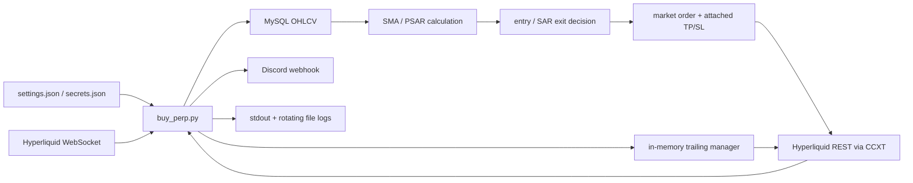

# Hyperliquid 自動取引 bot 現行仕様・リスク基準

> 調査基準日: 2026-08-13 
> 対象リビジョン: `3360d676b399c7536d8a59744ae11bb622b2b5df` 
> 対象: `crypto-spot-collector` の Hyperliquid 無期限先物 bot 
> 結論: **現状は無人の mainnet 運用に投入できない。** 本書で「危険」または「Critical / High」とした項目を解消し、testnet の連続稼働試験と明示承認を終えるまで mainnet 発注を禁止する。

この文書は、現行コードの挙動を将来の意図と混同しないためのスナップショットである。設定値は追跡対象の非機密ファイルだけから採取した。秘密鍵、ウォレットアドレス、Webhook URL、トークン等の値は記載していない。また、調査時に Hyperliquid への接続・照会・発注は行っていない。

## 1. 判定ラベル

| ラベル | 意味 |
| --- | --- |
| 実装済み | 対応するコード経路が存在する。安定性や安全性を保証する意味ではない |
| 不完全 | 通常経路は存在するが、再起動、部分失敗、競合、応答不明等を安全に処理できない |
| 未実装 | 安定運用に必要だが、対応する仕組みがない |
| 危険 | 実行・運用すると mainnet 発注、無防備なポジション、機密漏えい等につながり得る |

## 2. エントリーポイントと実行禁止範囲

| 対象 | 現行用途 | 判定 | 根拠 |
| --- | --- | --- | --- |
| `src/crypto_spot_collector/apps/buy_perp.py` | Docker Compose の Hyperliquid bot エントリーポイント | 不完全 | `docker-compose.yml:18-32` の `app_perp.command`。シグナル、注文、TP/SL、トレーリング、Discord を同一プロセスで実行する |
| `src/crypto_spot_collector/apps/hyperliquid_perp.py` | 旧mainnet単発スクリプト | **削除済み** | mainnet固定・起動時発注だったため実行経路ごと削除した。再追加は静的安全テストで拒否する |
| `Dockerfile` の既定 `CMD` | イメージを Compose 外で直接起動した場合の既定コマンド | 不完全 | `crypto_spot_collector/scripts/buy_spot.py` を指すが、現行構成と一致しない。Compose では上書きされる |
| `deploy.sh` | pull と Compose 再ビルド・起動 | 不完全 | 事前検査、エラー時停止、ロールバック、稼働確認がない |

自動取引の承認済みentrypointは `buy_perp.py` だけである。取引所adapterの生成には検証済み `TradingConfig` が必須で、mainnetはnetwork・allow flag・環境確認phraseの三重interlockを通る。破壊的なtestnet検証は `scripts/hyperliquid_testnet_acceptance.py`、read-only診断は `scripts/test_hyperliquid.py` に分離する。

## 3. 現行構成とデータフロー

状態は一か所に集約されていない。取引所がポジションと注文の正本、MySQL が OHLCV の保存先、プロセスメモリが SAR 方向・反対シグナル回数・トレーリング状態の保存先である。

| 状態 | 保存先 | 再起動後 |
| --- | --- | --- |
| ポジション、未約定注文、約定 | Hyperliquid | 残る |
| OHLCV | MySQL | 残る |
| SAR の前回方向、反対 SAR 回数 | プロセスメモリ | 消失する |
| トレーリング有効フラグ、高値・安値、加速係数 | プロセスメモリ | 消失し、TP/SL から一部を推測して再構成する |
| userFills の最終通知時刻 | プロセスメモリ | 消失する |

### 3.1 機能別の実装状態

| 機能 | 判定 | 現状 |
| --- | --- | --- |
| 11 銘柄の 30 分足収集、DB 保存、PSAR 算出 | 実装済み / 不完全 | 収集・保存・計算経路はあるが、確定足と鮮度を保証しない |
| SAR または価格変化による long/short 判定 | 実装済み / 不完全 | OR 条件は動くが、ポジション方向・重複 entry の guard がない |
| 成行 entry と attached TP/SL | 実装済み / 不完全 | 通常発注経路はあるが、cloid、fill 確認、応答不明時の照合がない |
| 反対 SAR 連続判定による reduce-only 決済 | 実装済み / 不完全 | 決済要求は行うが、完了確認前に次の entry 判定へ進む |
| トレーリング SL | 実装済み / 不完全 | 通常更新はあるが、追加・反転・再起動・部分失敗で状態がずれる |
| userFills の Discord 通知 | 実装済み / 不完全 | snapshot/delta と重複を区別せず、通知 I/O がイベントループを止め得る |
| WebSocket 再接続 | 実装済み / 不完全 | 有限回 retry はあるが、公式 heartbeat、欠落 reconcile、恒久復旧がない |
| 注文状態機械、冪等 retry、銘柄単位 lock | 未実装 | 同時処理、timeout、process restart 時の論理注文を一意にできない |
| fail-closed 起動、healthcheck、graceful shutdown | 未実装 | 同期失敗後も起動し、終了時の取引状態を検証しない |
| `hyperliquid_perp.py` の単発検証 | 削除済み | mainnet固定・即時注文経路を削除し、再追加を静的検査で拒否 |

## 4. 対象銘柄と現在の非機密設定

対象は以下の 11 銘柄で、CCXT のリニア無期限先物表現 `BASE/USDC:USDC` を使う (`buy_perp.py:103-116`)。

`BTC`, `ETH`, `XRP`, `SOL`, `HYPE`, `ZEC`, `FARTCOIN`, `LINK`, `AVAX`, `ADA`, `LTC`

追跡対象の `src/crypto_spot_collector/apps/settings.json` にある現在値は次のとおり。

| キー | 現在値 | 現行コードでの用途 |
| --- | ---: | --- |
| `perpetual.timeframe` | `30m` | OHLCV とシグナル評価間隔 |
| `perpetual.leverage` | `20` | TP/SL 価格計算に使用。ただし取引所へレバレッジ設定を送っていない |
| `perpetual.take_profit_rate` | `3.0` | TP トリガー計算の分子 |
| `perpetual.stop_loss_rate` | `0.2` | SL トリガー計算の分子 |
| `perpetual.amountByUSDC` | `200` | `数量 = 200 / 直近価格` |
| `perpetual.consecutivePositiveCount` | `4` | エントリー用 SAR 判定回数 |
| `perpetual.price_change_threshold_percent` | `999` | 価格変化シグナル閾値。現状は実質的に無効化された値 |
| `perpetual.trailing_stop_interval_minutes` | `3` | トレーリング監視間隔 |
| `perpetual.trailing_stop_activation_pnl_percent` | `7` | トレーリング開始判定に使うポジション `percentage` |
| `perpetual.sar_close_consecutive_count` | `2` | 反対向き SAR による決済までの評価回数 |
| `settings.sandbox_mode` | `false` | `false` は mainnet。安全側の既定値ではない |

### 4.1 設定スキーマ上の注意

- `settings.json` の `settings.timeframes` は別アプリ向けで、`buy_perp.py` は `settings.perpetual` と `settings.sandbox_mode` を参照する。
- `settings.json.sample` は現行ファイルと項目・値が同期していない。少なくとも `timeframe`、`consecutivePositiveCount`、`price_change_threshold_percent`、`sandbox_mode` が不足し、TP/SL、注文額、トレーリング値も異なる。
- `secrets.json.sample` が示す Hyperliquid の必須フィールド名は `hyperliquid.mainWalletAddress`、`hyperliquid.apiWalletAddress`、`hyperliquid.privatekey`。Discord は `discord.discordWebhookUrl` と `discord.discordBotToken`、Bybit は `bybit.apiKey` と `bybit.secret` を持つ。ここに示したのはスキーマ上の名前だけで、値は記載しない。
- `buy_perp.py` は Discord の perpetual 専用フィールド `discord.discordWebhookUrlPerpetual` を要求するが、`secrets.json.sample` にそのフィールドがない。サンプルから安全に起動できる契約になっていない。
- `load_config` は設定を浅く結合する。スキーマ検証、型・範囲検証、mainnet の明示承認検証はない。

## 5. 起動から終了までの現行挙動

### 5.1 起動

1. モジュール import 時に設定を読み、Discord、DB セッション、REST/WS クライアント、SAR 判定器、インメモリ状態を生成する (`buy_perp.py:118-152`)。
2. 取引所の全ポジションを取得し、対象 11 銘柄だけを走査する (`buy_perp.py:157-240`)。
3. ポジションに TP と SL が両方ある場合だけトレーリング管理へ登録する。ロングで `SL >= entry`、ショートで `SL <= entry` ならトレーリング済みと推定する。
4. 起動時同期の例外はログだけで握りつぶし、そのまま bot を起動する。保護注文を確認できない状態でも取引が継続し得る。
5. WebSocket に接続し、共有 listener、シグナルループ、トレーリングループ、userFills 通知ループを `asyncio.gather` で並行実行する (`buy_perp.py:1422-1448`)。

判定: 起動経路は**実装済み**だが、fail-closed ではないため安定運用としては**不完全**。

### 5.2 定期シグナル評価

30 分足の現在値では UTC の毎時 `00` 分・`30` 分に実行される (`buy_perp.py:680-773`)。銘柄ごとに逐次、次を行う。

1. 現在境界の 1 日前から OHLCV を取得する。
2. MySQL へ timestamp 単位で upsert する。
3. DB から同期間を読み、SMA 20/50 と PSAR (`step=0.02`, `max_step=0.2`) を計算する。
4. SAR、価格変化、既存ポジションを評価し、必要なら決済・新規注文を行う。

`fetch_ohlcv_async` は呼び出し側の `toDate` を取引所リクエストに反映せず、評価側の DB 範囲は終了時刻を含む。確定足だけに限定する明示処理もない。このため、境界直後に取得した形成中の最新足がシグナルへ入らない保証がない (`hyperliquid.py:125-146`, `buy_perp.py:731-770`)。

### 5.3 エントリー条件

ロング・ショートはそれぞれ次の OR 条件で成立する (`buy_perp.py:310-448`)。

- SAR 方向転換条件: 最新側の指定本数が PSAR の同一方向条件を満たす。現在は `consecutivePositiveCount=4`。
- 価格変化条件: `前の足の open` から `最新足の close` までを `(latest_close - previous_open) / previous_open * 100` で計算。ロングは閾値以上、ショートは負の閾値以下。現在の閾値 `999` では通常成立しない。

現在ポジションと同方向か、反対方向か、すでに注文処理中かを判定するエントリーガードはない。シグナルが継続すれば 30 分ごとに追加注文し得る。また、SAR 決済要求の直後にも同じ評価内で新規エントリー判定を続行する (`buy_perp.py:904-958`)。

### 5.4 注文数量、TP、SL

- 注文数量は `amountByUSDC / ticker.last`。現在値なら約 200 USDC の建玉想定数量である (`buy_perp.py:976-1002`, `buy_perp.py:1074-1100`)。
- 発注直前に、その銘柄で検出できた既存 TP/SL を両方キャンセルする。
- その後、成行エントリーに attached TP/SL を付けて CCXT へ送る。
- 呼び出し側が渡した価格は exchange 層で使わず、ticker を再取得してトリガー価格を計算する (`hyperliquid.py:169-257`)。

現行のトリガー式は以下。

| side | TP | SL |
| --- | --- | --- |
| long | `market × (1 + take_profit_rate / leverage)` | `market × (1 - stop_loss_rate / leverage)` |
| short | `market × (1 - take_profit_rate / leverage)` | `market × (1 + stop_loss_rate / leverage)` |

現在値では価格差が TP `15%`、SL `1%` になる。`rate` を百分率へ直す `/100` はない。さらにコードは `set_leverage` や margin mode 設定を呼ばないため、取引所の実レバレッジが 20 である保証もない。仮に実レバレッジが 20 なら、手数料・funding・slippage を除く単純な価格差×レバレッジは TP 約 300%、SL 約 20% に相当する。設定名と実際のリスク契約を確定する必要がある。

注文には client order id (`cloid`) がなく、再試行キー、注文状態照会、約定確認もない。タイムアウト等で応答が不明な場合に「未発注」と「発注済み」を区別できない。

### 5.5 反対 SAR による決済

ポジションと逆向きの SAR を評価ごとにメモリで数え、現在は 2 回連続で reduce-only 成行決済を要求する (`buy_perp.py:856-925`)。ただし次が未保証である。

- 決済の fill 完了や残数量を確認しない。
- カウンタは再起動で消える。
- 決済要求後に同じ処理で新規エントリーへ進む。
- 既存 TP/SL の残留や競合を最終照合しない。

### 5.6 TP/SL 再作成とトレーリング

起動後は設定値（現在は 3 分）ごとに取引所のポジションと TP/SL を同期する。`percentage` の絶対値と `unrealizedPnl` の符号を正規化し、利益側の ROE が設定値（現在は 7%）以上の場合だけトレーリングを開始する。損失、ゼロ損益、非数・無限値は開始条件を満たさない。開始時は既存 SL を不利な方向へ戻さず、少なくとも entry（breakeven）まで保護を移す。

- 初期加速係数 `0.02`、増分 `0.02`、上限 `0.2`。
- long: 新高値時に `SL += (high - SL) × AF`。
- short: 新安値時に `SL -= (SL - low) × AF`。

long の SL は上方向、short の SL は下方向にしか更新しない。各 3 分サイクルと起動時には取引所スナップショットを正とし、side・entry・contracts が一致する間だけ高値/安値/AFを引き継ぐ。反転、平均建値変更、部分決済または追加約定による数量変更ではパス状態をリセットする。外部決済で消えたポジションはローカル状態からも削除する。再起動時は現在の position と TP/SL から再構築し、取引所上の既存 SL より保護を弱めない。

取引所側の TP/SL 更新は、既存 TP と SL を先に両方キャンセルし、2 件を batch で再作成する (`hyperliquid.py:408-460`)。途中失敗時の rollback、片方だけ成功した場合の補修、再作成後の一意性確認がない。

高値・安値と AF 自体は取引所に保存されないため、プロセス再起動時は entry から初期化する。一方、現在 SL とトレーリング開始済みかどうかは取引所の保護注文から復元するので、再起動によって SL が後退することはない。

### 5.7 WebSocket と約定通知

- userFills を購読し、`dir` に close を含む最新 fill を Discord 通知する (`buy_perp.py:604-677`)。
- WebSocket は最大 5 回、概ね 5/10/20/40/60 秒上限の backoff で再接続し、保存済み subscription を再送する (`hyperliquid_ws.py`)。
- subscription の重複防止がなく、candle の unsubscribe でも復元用リストから消さない。
- 復元時のログが全 subscription に `coin` と `interval` を仮定するため、userFills では KeyError を起こし得る。
- 30 秒受信がない場合、ライブラリの WebSocket protocol ping を送る。Hyperliquid が案内する JSON の `{\"method\":\"ping\"}` / pong 契約とは異なる。
- userFills の初回 `isSnapshot=true` を区別せず、fill id 等で重複排除しない。再接続時に既存 fill を再通知し得る。
- orderUpdates を購読せず、accepted/open/filled/rejected/canceled を状態機械として追跡しない。
- 再接続上限後は listener が恒久停止し、自動復旧や fatal 通知がない。

### 5.8 Discord とログ

エントリー、エラー、トレーリング開始、SL 更新、決済 fill 等を Discord へ通知する。ログは stdout の INFO と、日次ローテーション・30 日保持・zip 化する DEBUG ファイルへ出す (`buy_perp.py:30-59`)。

現行 Discord 実装は async 関数内で同期 `requests.post` を timeout なしで呼ぶため、イベントループを止め得る。retry/backoff はなく、HTTP 200 以外を失敗扱いする。さらに `buy_perp.py:686-697` は起動時に perpetual Webhook URL の実値を INFO ログへ出す。これは**機密漏えいにつながる危険な実装**で、ログの失効・削除と Webhook rotation を検討する必要がある。

### 5.9 終了と Docker 運用

`main()` の `finally` は WS listener を cancel/await するだけで、REST クライアント、WS クライアント、DB セッション、バックグラウンド通知 task を閉じない。SIGTERM ハンドラ、注文中断点、終了時のポジション・保護注文照合もない (`buy_perp.py:1442-1456`)。

Compose の `app_perp` は secrets を read-only mount し、ログを host volume へ出す一方、healthcheck と restart policy がない。MySQL への `depends_on` は readiness を保証しない。イメージは Python 3.11 系だが、今回のローカルテストは Python 3.12.9 で実行された。

## 6. Hyperliquid 公式 API 契約との差分

以下は 2026-08-13 に確認した公式ドキュメントとの比較である。

| 公式契約・推奨 | 現行 | 必要対応 |
| --- | --- | --- |
| WebSocket 切断を前提に再接続し、欠落分は snapshot または Info API で補う | 有限回の再接続だけ。欠落照合なし | 再接続を継続可能にし、復旧ごとにポジション・注文・fill を REST で reconcile |
| streaming user data の最初のメッセージは `isSnapshot=true`、以後 false | flag を無視 | snapshot と差分を分け、fill identifier で重複排除 |
| heartbeat は JSON `ping` を送り、`pong` channel を受ける | protocol ping | 公式 JSON heartbeat と last-message 監視へ変更 |
| `orderStatus` は oid または 16-byte cloid を受け、状態と各種失敗理由を返す | cloid なし、注文後照会なし | 決定的 cloid、status poll/orderUpdates、終端状態を持つ注文状態機械を実装 |
| open orders、frontend open orders、user fills を Info API で取得可能 | TP/SL を `orderType` 文字列から 1 件ずつ拾うだけ | 起動・再接続・各 transaction 後に position/open order/fill を突合し、重複・不足を検出 |
| user-scoped query は agent/API wallet ではなく実際の account/master/subaccount を指定 | main wallet を public client/userFills に使用 | account モデルを設定スキーマで明示し、testnet で照合 |
| REST は IP 単位の aggregate 1200 weight/分など、WS は接続・subscription・message・inflight 上限あり | 各ループが独立に API を呼び、全 11 銘柄評価ごとに全 positions を再取得 | endpoint weight を持つ共有 limiter、cache、backoff、429 観測を実装 |
| `scheduleCancel` は指定時刻に全 open orders を cancel する dead man's switch | 未使用 | testnet で採否を決める。**推論:** 全注文 cancel のため保護 TP/SL も消す可能性があり、単純導入せずポジション縮退手順と一体で設計 |

公式資料:

- [WebSocket](https://hyperliquid.gitbook.io/hyperliquid-docs/for-developers/api/websocket)
- [Subscriptions](https://hyperliquid.gitbook.io/hyperliquid-docs/for-developers/api/websocket/subscriptions)
- [Timeouts and heartbeats](https://hyperliquid.gitbook.io/hyperliquid-docs/for-developers/api/websocket/timeouts-and-heartbeats)
- [Info endpoint](https://hyperliquid.gitbook.io/hyperliquid-docs/for-developers/api/info-endpoint)
- [Exchange endpoint](https://hyperliquid.gitbook.io/hyperliquid-docs/for-developers/api/exchange-endpoint)
- [Rate limits and user limits](https://hyperliquid.gitbook.io/hyperliquid-docs/for-developers/api/rate-limits-and-user-limits)

## 7. リスク台帳

| ID | 重要度 | リスクと現行証拠 | 修正先 |
| --- | --- | --- | --- |
| R-01 | Critical | `sandbox_mode=false` が追跡設定。安全確認なしで mainnet client を生成する | 戦略入力・mainnet 安全化 |
| R-02 | 解消済み | `hyperliquid_perp.py` を削除し、raw/legacy order APIと未検証adapter生成を実行可能コードの静的検査で禁止 | mainnet実行経路封鎖 |
| R-03 | Critical | Webhook URL を INFO ログに出す | 通信復旧・監視・終了制御 |
| R-04 | Critical | 確定足の保証がなく、形成中足でシグナルを出し得る | 戦略入力・mainnet 安全化 |
| R-05 | Critical | cloid、排他、再試行冪等性、応答不明時の照合がない | 注文状態機械・冪等性 |
| R-06 | Critical | TP/SL を先に cancel し、再作成の部分失敗を修復しない | ポジション復元・TP/SL 整合 |
| R-07 | Critical | 同一銘柄の signal loop と trailing loop が TP/SL を同時更新し得る | 注文状態機械 + TP/SL 整合 |
| R-08 | High | 起動同期に失敗しても注文処理を開始する | ポジション復元・TP/SL 整合 |
| R-09 | High | ポジションの有無・方向を entry guard にせず、継続シグナルで追加注文する | 戦略入力 + 注文状態機械 |
| R-10 | High | 反対 SAR 決済後に fill を待たず、新規 entry 評価を続ける | 注文状態機械・冪等性 |
| R-11 | High | 設定レバレッジを取引所へ設定せず、TP/SL rate の意味も曖昧 | 戦略入力・mainnet 安全化 |
| R-12 | High | 既存 trailing state が side/entry/position change を同期しない | ポジション復元・TP/SL 整合 |
| R-13 | High | WS snapshot、重複排除、公式 heartbeat、無期限復旧、欠落照合がない | 通信復旧・監視・終了制御 |
| R-14 | High | graceful shutdown、healthcheck、app restart policy、fatal 通知がない | 通信復旧・監視・終了制御 |
| R-15 | High | Discord I/O がイベントループを blocking し、timeout/retry もない | 通信復旧・監視・終了制御 |
| R-16 | High | 注文後の残高取得・描画・通知失敗も「注文作成エラー」と扱われ、実約定を照合しない | 注文状態機械・冪等性 |
| R-17 | High | sample 設定が実行時スキーマと同期せず、型・範囲検証もない | 戦略入力・mainnet 安全化 |
| R-18 | High | 回帰テスト 30 件中 18 件が失敗し、Hyperliquid/order/WS/trailing test がない | 回帰テスト基盤 |
| R-19 | Medium | 全銘柄ごとに全 positions を再取得し、共有 rate limiter がない | 通信復旧 + 回帰テスト |
| R-20 | Medium | OHLCV import 失敗を銘柄単位で継続し、データ鮮度・欠損を entry gate にしない | 戦略入力・mainnet 安全化 |

## 8. 現在のテスト基準線

調査時に `uv run --extra dev pytest -q` を実行した結果は **30 collected / 12 passed / 18 failed**。

- 14 件: SAR テストが旧引数 `consecutive_positive_count` を使い、実装の `consecutive_count` と不一致。
- 4 件: average price 関連の既存失敗。
- Hyperliquid exchange、WebSocket、注文状態、TP/SL transaction、trailing restore の自動テストはない。
- テストでは実アカウントやネットワークへ接続していない。

この基準線は「現行挙動が正常」の証明ではない。後続ではまず既存失敗の意図を確定し、外部 I/O を fake 化した failure-injection test を追加する。

## 9. 後続タスクの境界と着手順序

| 順序 | Todoist task | この文書から渡す境界・完了条件 |
| ---: | --- | --- |
| 1 | 戦略入力と mainnet 安全化 (`6hGPvqrMj7wwPXJ3`) | R-01/02/04/09/11/17/20。確定足、設定 schema、testnet default、明示 mainnet gate、position-aware entry を固定 |
| 2 | 注文状態機械と冪等性 (`6hGPvqwF459hvH8V`) | R-05/07/09/10/16。cloid、銘柄単位 lock、状態遷移、unknown outcome reconcile を実装 |
| 3 | ポジション復元と TP/SL 整合 (`6hGPvr6c87JvC2GV`) | R-06/07/08/12。起動時 fail-closed、exactly-one protective pair、追加・反転・部分失敗を修復 |
| 4 | 通信復旧・監視・終了制御 (`6hGPvr7GWXG2hrfV`) | R-03/13/14/15/19。snapshot/delta、JSON heartbeat、継続復旧、rate limit、health、graceful shutdown |
| 5 | 回帰テスト基盤 (`6hGPvr9fM78jGwg3`) | R-18 と上記全 failure path。実注文禁止 fake、決定的 clock、再接続・timeout・partial failure test |
| 6 | testnet soak と段階的 mainnet 受け入れ (`6hGPvrJR8W98hPXV`) | 先行 1-5 完了後のみ。testnet 連続稼働、障害注入、証跡レビュー、ユーザーの明示承認 |

実装順は上表だが、テストを最後まで保留する意味ではない。順序 1-4 の各変更に単体・failure-path test を同時追加し、順序 5 で横断シナリオと基準線を完成させる。注文状態機械と TP/SL 整合は設計を先に共有し、コード変更は銘柄単位 transaction/lock の境界を壊さないよう連続して進める。

## 10. mainnet No-Go / Go 条件

以下をすべて満たすまで **No-Go** とする。

- testnet が既定であり、mainnet は環境、アカウント、最大注文額、対象銘柄、有効期限を含む明示的な二段階承認が必要。
- 旧 `hyperliquid_perp.py` が存在せず、raw/legacy order APIと未検証adapter生成を静的安全テストが拒否する。
- 機密値をログへ出さず、過去ログと Webhook の扱いが確認済み。
- 確定足、データ鮮度、ポジション方向、最大 exposure、rate/TP/SL の単位を schema とテストで固定。
- cloid と注文状態機械により、timeout、process restart、重複 signal 時も at-most-once の意図を reconcile できる。
- 各 open position に期待数量を覆う TP/SL がちょうど 1 組あり、部分失敗時は新規 entry を止めて自動修復または安全縮退する。
- WS 再接続時に snapshot/delta を重複なく処理し、REST で position/order/fill の欠落を照合する。
- SIGTERM、DB/WS/Discord 障害、429、注文 rejection、partial fill、片側 TP/SL 作成失敗を自動テスト済み。
- testnet soak の期間・許容エラー・復旧時間・通知到達・残存注文ゼロを満たす。
- soak 証跡と残余リスクをユーザーがレビューし、mainnet 移行を明示承認する。

## 11. 調査対象コード

- `src/crypto_spot_collector/apps/buy_perp.py`
- `tests/test_execution_path_safety.py`
- `src/crypto_spot_collector/apps/settings.json`
- `src/crypto_spot_collector/apps/settings.json.sample`
- `src/crypto_spot_collector/apps/secrets.json.sample`
- `src/crypto_spot_collector/exchange/hyperliquid.py`
- `src/crypto_spot_collector/exchange/hyperliquid_ws.py`
- `src/crypto_spot_collector/exchange/trailingstop/trailingstop_manager.py`
- `src/crypto_spot_collector/providers/market_data_provider.py`
- `src/crypto_spot_collector/notification/discord.py`
- `docker-compose.yml`, `Dockerfile`, `deploy.sh`, `pyproject.toml`
